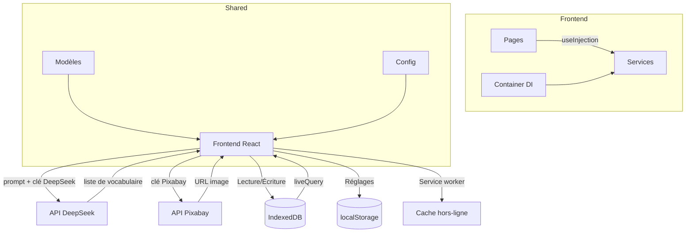

# GitHub Copilot Instructions pour Cadmus

## Vue d'ensemble du projet
Cadmus est une application PWA **frontend-only** (TypeScript) de flashcards pour apprendre une langue.
- **Frontend**: Application React 19 + Vite avec UI moderne (Shadcn components)
- **Shared**: Package de modèles et configurations partagés

L'application génère des catégories de vocabulaire à partir d'un prompt via l'API DeepSeek, illustre les cartes avec des photos (Pixabay, optionnel), et stocke tout localement (IndexedDB + localStorage). Un service worker permet un fonctionnement 100% hors-ligne après le premier chargement.

## Architecture générale

### Frontend (/frontend)
- Framework: React 19 + Vite
- Styling: Tailwind CSS 4 + Shadcn UI components
- State Management: Container pattern custom avec tsyringe (injection de dépendances)
- Structure: Features-based avec pages, services et composants par domaine
- Persistance: Dexie (IndexedDB) pour les données, localStorage pour les réglages
- Build: TypeScript avec tsc, ESM-first

**Domaines principales:**
- `_shared/services/`: `DatabaseService.ts` (wrapper Dexie)
- `ai/`: Génération de vocabulaire par IA
  - services/: `DeepSeekService.ts`, ports/
- `images/`: Recherche d'images (Pixabay)
  - services/: `ImageSearchService.ts`, ports/
- `categories/`: Gestion des catégories (decks)
  - pages/: `CategoriesPage.tsx`
  - components/: `CreateCategoryDialog.tsx`, `CategoryCard.tsx`
  - services/: `CategoriesService.ts`, ports/
- `flashcards/`: Révision des cartes (système Leitner)
  - pages/: `FlashcardReviewPage.tsx`
  - components/: `FlashcardCard.tsx`
  - services/: `FlashcardsService.ts`, `flashcard-scheduler.ts`, ports/
- `settings/`: Réglages (clés API, langues)
  - pages/: `SettingsPage.tsx`
  - models/: `languages.ts`
  - services/: `SettingsService.ts`, ports/

### Shared (/shared)
- Modèles TypeScript partagés (interfaces, types)
- `config.ts`: Configuration globale (URLs API, ports)
- `models/FlashcardModels.ts`: `IFlashcard`, `IFlashcardCategory`, `IAppSettings`, etc.

## Conventions de code

### Générale
- **Langage**: TypeScript strict
- **Format**: Biome.json pour linting et formatting
- **Modules**: ESM (import/export)
- **Naming**: camelCase pour variables/fonctions, PascalCase pour classes/types
- **Clean architecture**: interfaces ports (I*Service) + services injectables (tsyringe)
- **DI**: tokens dans `frontend/src/di-constants.ts`, enregistrement dans `frontend/src/container.ts`

### Frontend
- Composants: Fonctionnels avec hooks React (fonctions fléchées)
- Services: Classes avec injection de dépendances via `@injectable` / `@inject`
- Fichiers de page: Pattern `pages/[Feature]Page.tsx`
- Imports partagés: Alias `@shared/*` (modèles) et `@/*` (src)

### Backend
- Absent pour l'instant (application frontend-only). Les modèles partagés vivent dans `/shared`.

## Dépendances clés
- Frontend: React 19, Vite, Tailwind 4, Shadcn UI, tsyringe, Dexie, React Router, Sonner (toasts)
- Tous: TypeScript, Biome

## Build et déploiement
- Build Frontend: `npx tsc -b && vite build` (génère dist/ + manifest + service worker)
- Tests: Jest (ts-jest)
- Déploiement: statique (frontend/dist) via serve/Docker/nginx
- PWA: service worker manuel dans `frontend/public/sw.js`, manifest dans `frontend/public/manifest.webmanifest`

## Flux de données - Diagramme

## Points clés pour l'assistance
1. Respecter la structure features-based et domain-driven
2. Utiliser le pattern Container/Dependency Injection existant (tsyringe, `di-constants.ts`)
3. Maintenir la cohérence TypeScript strict
4. Les modèles doivent être définis dans /shared et importés via `@shared/*`
5. Persister les données dans IndexedDB (Dexie), les réglages dans localStorage
6. Toujours utiliser Biome pour le formatting
7. Toute documentation, consigne ou réponse liée aux conventions, au style ou au code du projet doit toujours référencer le fichier de conventions adapté au langage concerné :
  - .github/NAMING-CONVENTIONS-JSTS.md pour JS/TS/JSX/TSX
  - .github/NAMING-CONVENTIONS-REACT.md pour React (JS/TS/TSX)
  (au même titre que ce fichier) et s'y conformer strictement.

## Fichiers de configuration importants
- `biome.json`: Linting et formatting (monorepo)
- `frontend/vite.config.ts`: Build Vite (alias `@`, `@shared`)
- `frontend/jest.config.js`: Tests
- `frontend/tsconfig.json`: Configuration TypeScript frontend
- `tsconfig.json`: Configuration TypeScript root
